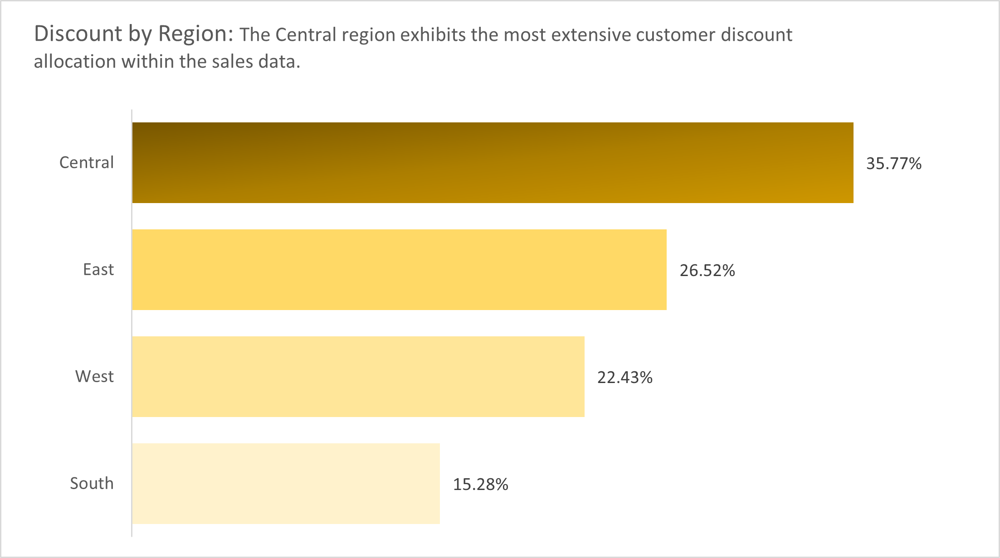

# Unveiling-Profit-Opportunities-In-Depth-Analysis-of-U.S.-Superstore-Sales-Data
Seeking thorough insights from U.S. superstore sales data to discover opportunities for improving profitability.

         

## Introduction

In this comprehensive analysis, we delve into U.S. superstore sales data, addressing pivotal business questions. Through data cleansing, in-depth analysis, and compelling visualizations, we unveil actionable insights to optimize profitability and strategic decision-making. 

Join me as I analyze these datasets..🙂😉

_**Disclaimer**_ ⚠️- _All data used for this analysis are hypothetical data generated and do not represent any company's data or an attempt to endanger their performance._

## U.S SUPERSTORE
The task will address the following KPIs and Business questions respectively...
1. Total Sales within the five years of operation: how has sales revenue changed over the past years?
2. Sales by Region/State: which region is our strongest market and which are underperforming?
3. Ship Mode: how efficient is our ship mode in terms of delivery times, and how can improvements in ship mode selection positively impact customer service and cost-effectiveness?
4. Discount by Region: how do discount rates vary by region, and what impact do these variations have on regional sales, and overall profitability?
5. Total Profit within the five years of operation: how has profit changed over the past years considerng profit by region, product with the highest profit and the underperforming product.

**Data Set**                                    |   **Overall Summary of the Data**             
:----------------------------------------------:|:--------------------------------:
                                     |                         

## Problem Statement:

My goal is to extract meaningful insights from the sales and profit statistics of a U.S. superstore through a comprehensive five-year examination. In particular, I'll look at how sales income has changed over time, pinpoint the strongest and weakest areas, analyze the effectiveness of the selected shipping options, look into regional differences in discount rates, and gauge the total profitability. Through the interconnection of these essential components, this thorough analysis aims to uncover potential for revenue optimization, cost reduction, and customer service improvement. Maximizing the superstore's profitability and operational effectiveness is the ultimate objective.

## Skill and Concept Demonstrated:

The analysis had demonstrated a range of essential data analysis skills, such as:
- Data extraction
- Data Cleaning and Transformation
- Data Validation
- Excel functions (e.g., XLOOKUP, SUM, AVERAGE, COUNTIF, MAX and MIN)
- Statistical measures and conditional logic to make data-driven decisions.
- Data Visualization and Analysis

## Data Sourcing:

The medical student data was provided by the instructor in CSV format. The dataset contained information about medical students, including age, gender, BMI, temperature, heart rate, blood pressure, cholesterol, height, weight, blood group, smoking status, and diabetes status.

## Data Transformation:

Upon importing the CSV data into Microsoft Excel, thorough data cleaning processes were started. This involved the elimination of duplicate values and eradication of any missing data entries. Data validation and verification procedures were strictly followed in order to improve data correctness and integrity; this comprehensive approach to data preparation ensured that the dataset was pristine and well-suited for subsequent analysis.:muscle:

## DAta Visualization and Analysis

### *Total Sales within the five years of operation*

### *Sales by Region/State: Region with strongest market and underperforming region as well as Top 10 States*

*Sales by Region*                               |   *Top 10 States*                
:----------------------------------------------:|:--------------------------------:
                           |                       

### *Ship Mode: Efficiency of the shippng mode, Frequency of Days in delivery times, and Most used shipping mode*
:fire: Kindly click on each of the pictures to get a proper view.

*Efficiency of the shippng mode*      |   *Frequency of Days in delivery times*     | *Most used shipping mode*
:------------------------------------:|:-------------------------------------------:|:-------------------------:
                      |                      |   

## *Discount by Region: Total discount given by region*
  

## *Total Profit within the five years of operation*
 

In pursuit of a more comprehensive understanding of our profit dynamics, a detailed investigation was undertaken. The analysis delved into profit margins across sub-categories, profit distribution by region, and the identification of products driving the highest profitability. Simultaneously, it brought to light the underperforming products that warrant particular attention. The following insights emerged from this rigorous examination:

----

----
*Product with High Profit*                         |        *Product with Low Profit*     
:-------------------------------------------------:|:---------------------------------------------:
                       |          
----

## Conclusions and Recommendations

Based on the analysis:

- The five-year analysis of total U.S. store sales reveals consistent year-on-year growth with seasonal fluctuations. The peak, in **Q4 2017**, saw **277,806 units sold**. However, a concerning drop in **Q1 2018** demands swift action to sustain our positive sales trajectory.
- The analysis highlights substantial disparities in sales performance, with the West and East regions achieving the highest figures at **725,458** and **678,781,** while the South region lags behind at **391,722.** To address this, recommend focused marketing and product strategies to revitalize the underperforming South region. Simultaneously, advise maintaining vigilance in the thriving West and East regions by staying attuned to market dynamics and evolving customer preferences, ensuring sustained growth.
- Upon scrutinizing shipping times, it is evident that, on average, order fulfillment occurs within a commendable four-day window, encompassing **6,001 orders**. However, the focus now pivots toward the remaining **3,993 orders** exceeding this threshold. To rectify this, it is advised to optimize inventory management by streamlining stock levels to curtail delays and enhance logistics processes. This entails exploring strategies to expedite the shipping process and reduce delivery times for the outstanding orders.
- The examination of discount rates across regions uncovers intriguing insights. Surprisingly, the Central region leads in customer discount allocation, despite this, it displays a negative impact on sales profitability, yielding the lowest profit at **$39,706.** In contrast, the West region, while being third in terms of discount allocation, attains the highest profit at **$108,418.** To rectify this profit gap, three key recommendations include optimizing pricing strategies, reassessing discount allocation, and conducting a competitive analysis to refine the product mix and pricing in the Central region.
- Lastly, the analysis of profit dynamics unveils a crucial pattern: a peak in **Q4 2016** at **$38,414** followed by an alarming **Q1 2018 decline,** necessitating thorough examination. Notably, the West region excels in profitability, whereas the Central region lags. Additionally, we've identified the highest and lowest-profit products. In response, recommended actions include scrutinizing **Q1 2018,** optimizing Central region sales and marketing strategies, and a comprehensive product mix analysis, encompassing potential expansion and reevaluation of underperforming products.

---

## Acknowledgemnent 🙏 🙏

Online sources were used to obtain the first and last image in this documentation:
- https://pngtree.com
- https://www.freepik.com

