# Unveiling-Profit-Opportunities-In-Depth-Analysis-of-U.S.-Superstore-Sales-Data
Seeking thorough insights from U.S. superstore sales data to discover opportunities for improving profitability.

         

## Introduction

In this comprehensive analysis, we delve into U.S. superstore sales data, addressing pivotal business questions. Through data cleansing, in-depth analysis, and compelling visualizations, we unveil actionable insights to optimize profitability and strategic decision-making. 

Join me as I analyze these datasets..🙂😉

_**Disclaimer**_ ⚠️- _All data used for this analysis are hypothetical data generated and do not represent any company's data or an attempt to endanger their performance._

## U.S SUPERSTORE
The task will address the following KPIs and Business questions respectively...
1. Total Sales within the five years of operation: how has sales revenue changed over the past years?
2. Sales by Region/State: which region is our strongest market and which are underperforming?
3. Ship Mode: how efficient is our ship mode in terms of delivery times, and how can improvements in ship mode selection positively impact customer service and cost-effectiveness?
4. Discount by Region: how do discount rates vary by region, and what impact do these variations have on regional sales, and overall profitability?
5. Total Profit within the five years of operation: how has profit changed over the past years considerng profit by region, product with the highest profit and the underperforming product.

**Data Set**                                    |   **Overall Summary of the Data**             
:----------------------------------------------:|:--------------------------------:
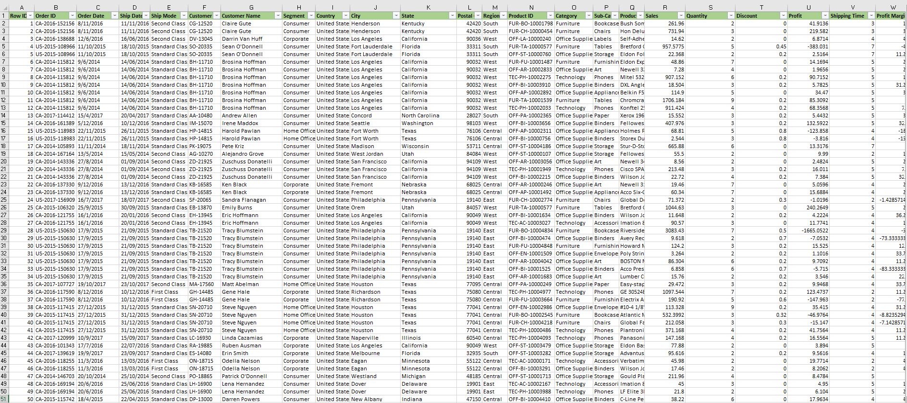                                     |          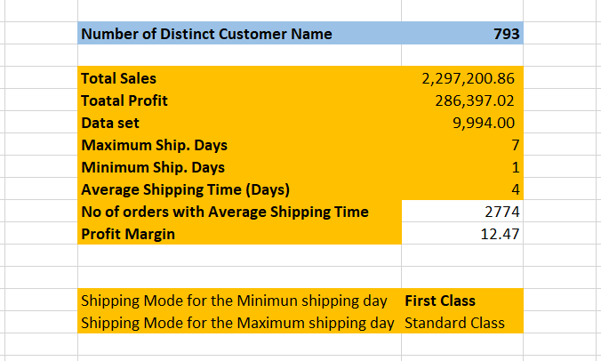               

## Problem Statement:

My goal is to extract meaningful insights from the sales and profit statistics of a U.S. superstore through a comprehensive five-year examination. In particular, I'll look at how sales income has changed over time, pinpoint the strongest and weakest areas, analyze the effectiveness of the selected shipping options, look into regional differences in discount rates, and gauge the total profitability. Through the interconnection of these essential components, this thorough analysis aims to uncover potential for revenue optimization, cost reduction, and customer service improvement. Maximizing the superstore's profitability and operational effectiveness is the ultimate objective.

## Skill and Concept Demonstrated:

The analysis had demonstrated a range of essential data analysis skills, such as:
- Data extraction
- Data Cleaning and Transformation
- Data Validation
- Excel functions (e.g., XLOOKUP, SUM, AVERAGE, COUNTIF, MAX and MIN)
- Statistical measures and conditional logic to make data-driven decisions.
- Data Visualization and Analysis

## Data Sourcing:

The medical student data was provided by the instructor in CSV format. The dataset contained information about medical students, including age, gender, BMI, temperature, heart rate, blood pressure, cholesterol, height, weight, blood group, smoking status, and diabetes status.

## Data Transformation:

Upon importing the CSV data into Microsoft Excel, thorough data cleaning processes were started. This involved the elimination of duplicate values and eradication of any missing data entries. Data validation and verification procedures were strictly followed in order to improve data correctness and integrity; this comprehensive approach to data preparation ensured that the dataset was pristine and well-suited for subsequent analysis.:muscle:

## DAta Visualization and Analysis

### *Total Sales within the five years of operation*

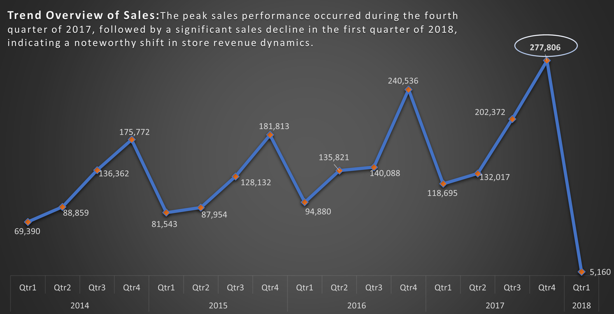

### *Sales by Region/State: Region with strongest market and underperforming region as well as Top 10 States*

*Sales by Region*                               |   *Top 10 States*                
:----------------------------------------------:|:--------------------------------:
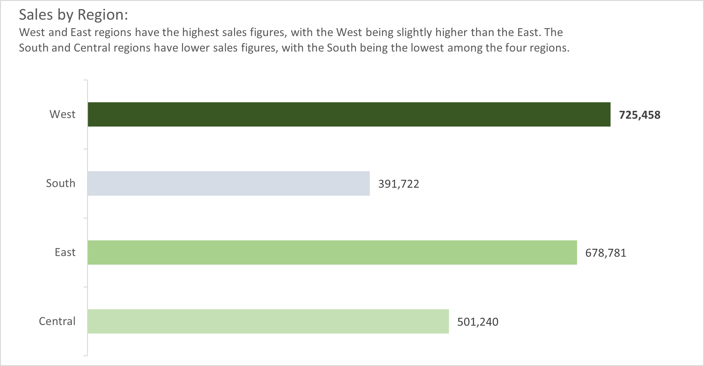                           |      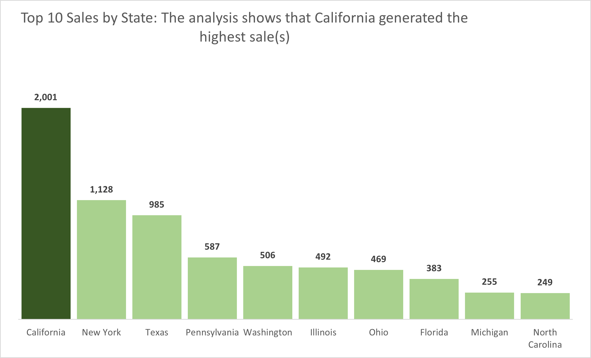                 

### *Ship Mode: Efficiency of the shippng mode, Frequency of Days in delivery times, and Most used shipping mode*
:fire: Kindly click on each of the pictures to get a proper view.

*Efficiency of the shippng mode*      |   *Frequency of Days in delivery times*     | *Most used shipping mode*
:------------------------------------:|:-------------------------------------------:|:-------------------------:
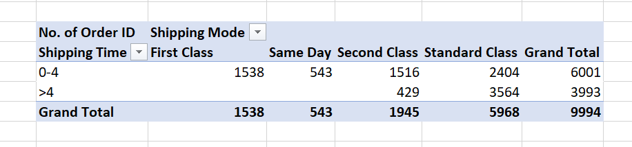                      |        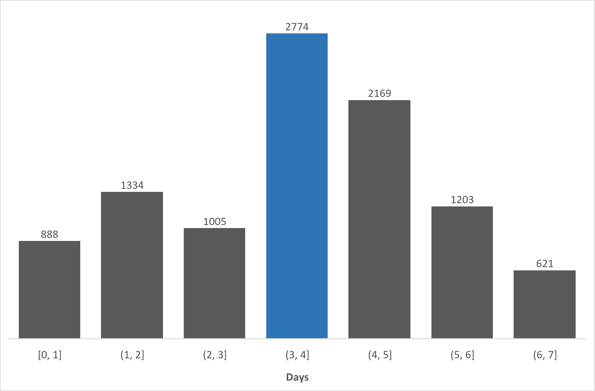              |   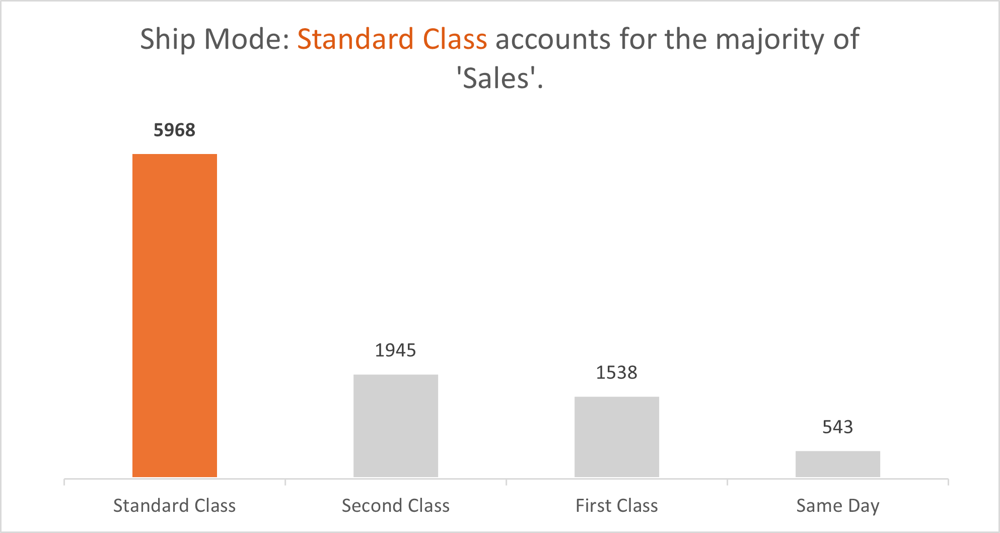

## *Discount by Region: Total discount given by region*
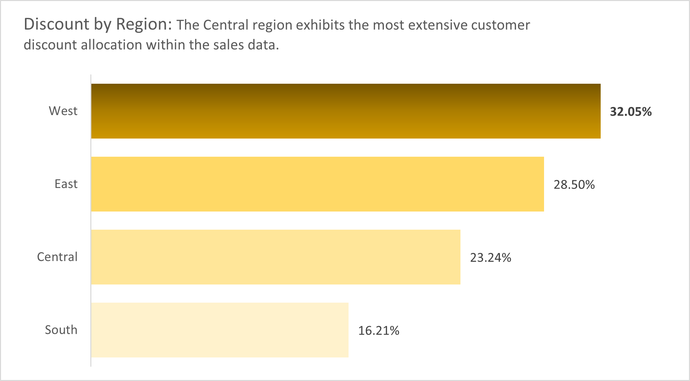  

## *Total Profit within the five years of operation*
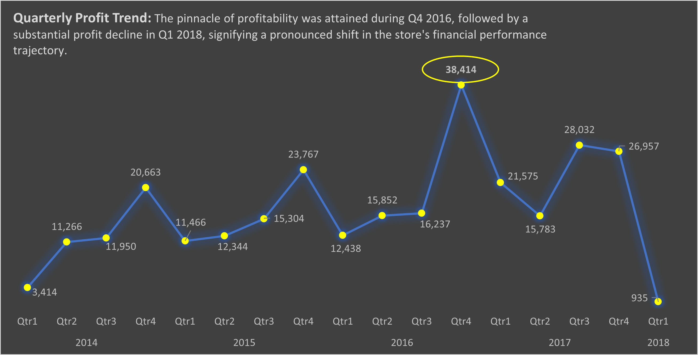 

In pursuit of a more comprehensive understanding of our profit dynamics, a detailed investigation was undertaken. The analysis delved into profit margins across sub-categories, profit distribution by region, and the identification of products driving the highest profitability. Simultaneously, it brought to light the underperforming products that warrant particular attention. The following insights emerged from this rigorous examination:

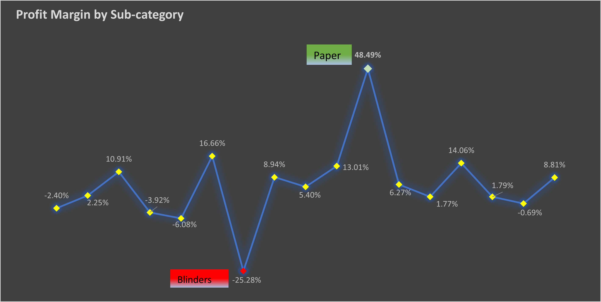
----

----
*Product with High Profit*                         |        *Product with Low Profit*     
:-------------------------------------------------:|:---------------------------------------------:
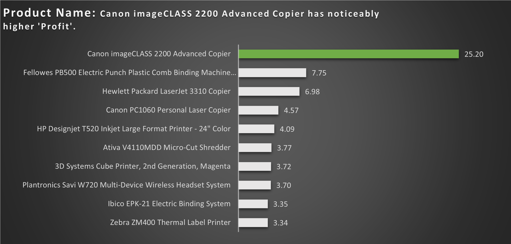                       |        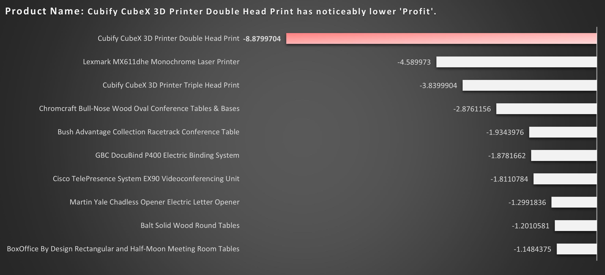  
----

## Conclusions and Recommendations

Based on the analysis:

- I discovered a need to clarify the "Unspecified" category in the dataset; it's essential to investigate and categorize the 20,000 unspecified cases. Without knowing their smoking status, it's challenging to make informed decisions or provide targeted support or interventions.
- Implement a process to reach out to these students to determine their smoking status, whether they are smokers, non-smokers, or former smokers. This can be done through surveys, interviews, or self-reporting mechanisms.
- Promote smoking cessation programs with 36,029 students identified as smokers, there is a significant opportunity to implement smoking cessation programs within the medical student community.
- Programs can include counseling, access to nicotine replacement therapy, educational materials, and support groups.Encourage and incentivize smokers to participate in these programs to help them quit smoking and improve their overall health.
- In regards to the 18,014 diabetic students, provide diabetes-specific health education and monitoring programs for them, emphasizing on self-care, regular glucose monitoring, and lifestyle management.
- Collaborate with campus cafeterias to offer healthier, diabetes-friendly meal choices and provide nutritional information, promoting better dietary options for them.

Lastly, it would be beneficial to periodically update the data and conduct follow-up assessments to track changes in the smoking status and diabete status as well as the effectiveness intervention programs put in place.

---
# THANK YOU !

## Acknowledgemnent 🙏 🙏

Online sources were used to obtain the first and last image in this documentation:
- https://pngtree.com
- https://www.freepik.com

